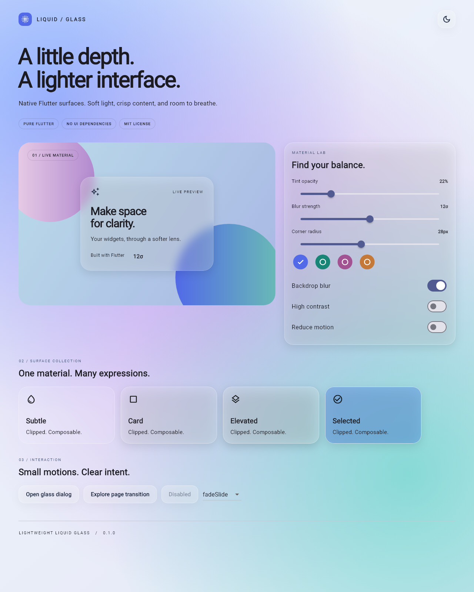

# Lightweight Liquid Glass · 轻量玻璃 UI 组件库

使用 **Flutter / Dart 原生能力**实现的轻量 Liquid Glass 风格组件库。通过背景模糊、半透明着色、渐变边框和柔光高光，为任意 Flutter Widget 提供玻璃容器，同时保持前景文字和交互内容清晰。

**当前版本：0.1.0 · Flutter ≥ 3.44.0 · Dart ≥ 3.12.0 · MIT License**

## 在线示例

**[打开 Liquid Glass 在线体验](https://lightweight-liquid-glass-lab.marseille-cjh.chatgpt.site)**

手机和电脑浏览器均可访问，无需安装 Flutter。示例包含：

- 浅色 / 深色主题切换。
- 透明度、模糊强度、圆角和强调色调节。
- 多种玻璃卡片、按钮、图标按钮、禁用状态和弹窗。
- 五种页面切换效果，以及详情页玻璃 AppBar。
- 关闭模糊、高对比度、减少动画开关。
- 桌面与手机响应式布局。



## 项目目标与技术要求

组件库与业务无关，可以包裹任意 Flutter Widget，适合作为独立 GitHub 开源项目使用。它模拟 Liquid Glass 的视觉风格，不包含真实光学折射或 Apple 专有渲染实现。

| 技术要求 | 第一版的实现 |
| --- | --- |
| 使用 Flutter 原生接口 | 使用 `BackdropFilter`、`ImageFilter`、`ClipRRect`、`CustomPainter`、`Gradient`、`ThemeExtension`、`Material` 和 `InkWell`；圆形裁剪使用 `ClipOval` |
| 支持浅色、深色、高对比度、减少动画和关闭模糊后的降级显示 | 提供深浅色主题、系统无障碍设置响应、手动无障碍配置及降级颜色 |
| 重点保证 Android 性能，同时尽可能兼容其他 Flutter 平台 | 限定模糊区域和强度，提供分组过滤、质量等级与特效开关；Android 实际帧率仍需在目标设备上验证 |
| 避免持续动画模糊半径 | 样式切换直接采用目标模糊参数；页面动画仅使用透明度、位移和轻微缩放 |
| 不包含任何雨课堂业务类型或业务代码 | 只包含通用 UI、主题、动画、性能配置和演示页面 |
| API 保持简洁，避免重复组件和过度抽象 | 以 `GlassSurface` 为底层容器，常用组件复用同一套样式与渲染实现 |
| 不使用 Kotlin、Compose、PlatformView 或第三方 UI 依赖 | 组件库运行时只依赖 Flutter SDK，不包含上述平台 UI 实现或平台通道 |

示例应用保留 Flutter 标准平台启动工程，Android 入口为 Java `FlutterActivity`；`.gradle.kts` 属于构建配置，不承担玻璃 UI 渲染。库本身没有自定义原生渲染代码，也不需要额外图片或自定义着色器资源。

## 快速开始

### 1. 添加依赖

目前可使用本地路径接入。请将路径改为相对于你自己应用的实际组件库目录：

```yaml
dependencies:
  flutter:
    sdk: flutter
  lightweight_liquid_glass:
    path: ../Flutter_liquid_glass
```

然后运行：

```sh
flutter pub get
```

GitHub 仓库地址暂未配置；发布仓库后可改用 Git 依赖。这里不使用尚未确认存在的 pub.dev 版本或仓库地址。

### 2. 运行最小示例

将下面代码放入接入应用的 `lib/main.dart`：

```dart
import 'package:flutter/material.dart';
import 'package:lightweight_liquid_glass/lightweight_liquid_glass.dart';

void main() => runApp(const DemoApp());

class DemoApp extends StatelessWidget {
  const DemoApp({super.key});

  @override
  Widget build(BuildContext context) {
    return MaterialApp(
      debugShowCheckedModeBanner: false,
      themeMode: ThemeMode.system,
      theme: ThemeData(
        brightness: Brightness.light,
        extensions: const [LiquidGlassThemeData()],
      ),
      darkTheme: ThemeData(
        brightness: Brightness.dark,
        extensions: [LiquidGlassThemeData.dark()],
      ),
      home: Scaffold(
        body: GlassBackdrop(
          child: Center(
            child: GlassSurface(
              width: 280,
              padding: const EdgeInsets.all(24),
              child: const Column(
                mainAxisSize: MainAxisSize.min,
                children: [
                  Icon(Icons.water_drop_outlined, size: 36),
                  SizedBox(height: 16),
                  Text('你好，Liquid Glass'),
                  SizedBox(height: 8),
                  Text('把你自己的 Widget 放在这里'),
                ],
              ),
            ),
          ),
        ),
      ),
    );
  }
}
```

**玻璃后方需要有实际绘制的内容，模糊效果才明显。** 可以使用本库的 `GlassBackdrop`，也可以使用自己的图片、渐变或其他 Widget。模糊和色彩过滤只作用于背景，不会模糊 `child`。

以下代码片段均使用相同的两个 import；涉及 `context` 的片段应放在页面的 `build` 方法或事件回调中。

## 第一版公开接口

所有公开接口统一从以下入口导入：

```dart
import 'package:lightweight_liquid_glass/lightweight_liquid_glass.dart';
```

### 1. GlassSurface：通用玻璃容器

用于包裹文字、图标、表单、自定义布局等任意 Flutter Widget。

| 参数 | 类型 / 默认值 | 功能 |
| --- | --- | --- |
| `child` | `Widget`，必填 | 前景内容 |
| `width`、`height` | `double?` | 容器宽度、高度 |
| `constraints` | `BoxConstraints?` | 最小 / 最大尺寸约束 |
| `padding` | `EdgeInsetsGeometry?` | 内容内边距 |
| `margin` | `EdgeInsetsGeometry?` | 容器外边距 |
| `alignment` | `AlignmentGeometry?` | 内容对齐方式 |
| `style` | `GlassStyle?` | 外观；未指定时使用主题的 `defaultStyle` |
| `clipBehavior` | `Clip.antiAlias` | 裁剪方式 |
| `enabled` | `true` | 是否启用玻璃装饰及背景过滤 |
| `fallbackColor` | `Color?` | 不使用模糊时的降级颜色；默认随深浅色主题变化 |

```dart
GlassSurface(
  width: 300,
  constraints: const BoxConstraints(minHeight: 100),
  padding: const EdgeInsets.all(20),
  margin: const EdgeInsets.all(12),
  alignment: Alignment.centerLeft,
  style: LiquidGlassTheme.of(context).defaultStyle.copyWith(
    tintOpacity: 0.3,
    borderRadius: BorderRadius.circular(28),
  ),
  child: const Text('一个可以复用的玻璃容器'),
)
```

使用约定：

- `enabled: false` 移除玻璃效果，但保留布局和裁剪，**不会禁用子组件交互**。
- `Clip.none` 会按 `Clip.hardEdge` 处理，防止背景过滤扩展到整个页面。
- `fallbackColor` 的 alpha 会被设为 1；如果没有配置背景渐变，降级表面是不透明的。
- `shape: BoxShape.circle` 使用椭圆裁剪；宽高相等时才是正圆。

### 2. AnimatedGlassSurface：样式切换

支持 `GlassStyle` 平滑切换，并提供 `GlassSurface` 相同的布局、裁剪、启用状态及降级颜色参数。

| 参数 | 默认值 | 功能 |
| --- | --- | --- |
| `child` | 必填 | 前景内容 |
| `style` | 必填 | 本次切换的目标样式 |
| `duration` | 240 毫秒 | 切换时长 |
| `curve` | `Curves.easeOutCubic` | 插值曲线 |

下面的 `selected` 是页面状态中的布尔值，改变它并调用 `setState` 即可触发动画：

```dart
AnimatedGlassSurface(
  duration: const Duration(milliseconds: 240),
  curve: Curves.easeOutCubic,
  padding: const EdgeInsets.all(20),
  style: LiquidGlassTheme.of(context).cardStyle.copyWith(
    tintOpacity: selected ? 0.4 : 0.18,
    borderRadius: BorderRadius.circular(selected ? 32 : 20),
  ),
  child: const Text('选中时改变透明度和圆角'),
)
```

颜色、透明度、圆角、边框等可插值属性会平滑变化。`blurSigmaX`、`blurSigmaY` 和 `blurEnabled` 则直接采用目标值，不逐帧动画模糊核；形状与其他布尔值按离散规则切换。开启减少动画时，样式立即更新。

### 3. GlassStyle：不可变样式

通过构造函数创建样式，或使用 `copyWith` 修改现有样式。支持值相等比较和 `hashCode`。

| 字段 | 默认值 | 功能 |
| --- | --- | --- |
| `blurSigmaX`、`blurSigmaY` | 12、12 | 横向 / 纵向背景模糊强度，受性能配置上限约束 |
| `blurEnabled` | `true` | 样式级模糊开关 |
| `tintColor`、`tintOpacity` | 白色、0.16 | 表面着色与不透明度 |
| `backgroundGradient` | `null` | 可选背景渐变 |
| `saturation`、`contrast` | 1、1 | 背景饱和度与对比度；1 表示不调整，不影响前景内容 |
| `borderColor`、`borderOpacity` | 白色、0.38 | 边框颜色与不透明度 |
| `borderWidth` | 1 | 边框宽度 |
| `borderGradient` | `null` | 可选渐变边框 |
| `borderRadius` | 半径 24 | 矩形圆角，类型为 `BorderRadius` |
| `shape` | `BoxShape.rectangle` | 矩形或 `BoxShape.circle` |
| `highlightColor`、`highlightOpacity` | 白色、0.18 | 边缘高光颜色与不透明度 |
| `highlightAngle` | -0.8 | 高光方向，单位为弧度 |
| `shadowColor`、`shadowOpacity` | 黑色、0.10 | 阴影颜色与不透明度 |
| `shadowBlurRadius`、`shadowOffset` | 20、`Offset(0, 8)` | 阴影模糊半径与偏移 |
| `noiseOpacity`、`noiseEnabled` | 0.025、`false` | 静态噪点强度及开关 |

```dart
final style = GlassPresets.card.copyWith(
  blurSigmaX: 10,
  blurSigmaY: 10,
  tintColor: const Color(0xffdbeafe),
  tintOpacity: 0.25,
  saturation: 1.1,
  contrast: 1.05,
  borderWidth: 1.2,
  borderRadius: BorderRadius.circular(24),
  borderGradient: const LinearGradient(
    begin: Alignment.topLeft,
    end: Alignment.bottomRight,
    colors: [Colors.white70, Colors.white10],
  ),
  highlightOpacity: 0.2,
  shadowOpacity: 0.08,
);

final withoutGradient = style.copyWith(borderGradient: null);
final halfway = GlassStyle.lerp(GlassPresets.subtle, style, 0.5);
```

属性规则：

- 不透明度范围为 0–1，会与颜色本身的 alpha 相乘。模糊、边宽、阴影半径、饱和度和对比度应为非负有限值；构造函数包含调试断言。
- `backgroundGradient` 使用 Flutter `BoxDecoration` 的渐变填充规则，存在时优先于纯色填充；想透出背景，应在渐变颜色中设置透明度。
- 即使关闭模糊，自定义背景渐变仍可保留。需要确保完全不透明时，应清除渐变或启用 `reduceTransparency` / 高对比度。
- `borderGradient` 存在时使用渐变边框，透明度由渐变颜色决定。高光绘制在边缘，边宽为 0 时也不会绘制高光。
- `copyWith(backgroundGradient: null)` 和 `copyWith(borderGradient: null)` 可以显式清除渐变；不传参数则保留原值。
- `GlassStyle.lerp(a, b, t)` 将 `t` 限制在 0–1，插值数值、颜色、偏移、圆角与渐变；布尔值和形状在中点切换。该方法会插值模糊数值，但 `AnimatedGlassSurface` 特意不使用逐帧模糊插值。
- 噪点只有在样式的 `noiseEnabled` 和性能配置的 `enableNoise` 同时为 `true` 时才显示。

### 4. GlassBackdrop：渐变与柔光背景

为玻璃表面提供有层次的背景，无需准备图片素材。

| 参数 | 默认值 | 功能 |
| --- | --- | --- |
| `child` | `null` | 放在背景上方的页面内容 |
| `gradient` | `null` | 自定义底层渐变；默认根据主题生成 |
| `colors` | 蓝、紫、青三种颜色 | 程序化柔光光斑颜色 |
| `intensity` | 1 | 光斑强度，范围 0–1；不会改变 child 或底层渐变的不透明度 |
| `animate` | `false` | 是否启用缓慢光斑位移 |

```dart
GlassBackdrop(
  intensity: 0.7,
  animate: false,
  colors: const [
    Color(0xff7a9fff),
    Color(0xffcfa5ee),
    Color(0xff70d8cf),
  ],
  child: const Center(
    child: GlassCard(child: Text('柔光背景上的卡片')),
  ),
)
```

背景需要有限宽高，适合放在 `Scaffold.body` 或明确尺寸的 `SizedBox` 中。可选动画只移动缓存的光斑绘制层，不改变模糊半径；系统减少动画、性能动画开关或 `TickerMode` 禁用时会停止。

### 5. LiquidGlassTheme / LiquidGlassThemeData：主题

`LiquidGlassThemeData` 继承 `ThemeExtension`，可以放进 `ThemeData.extensions`；`LiquidGlassTheme` 提供局部主题覆盖。

| 字段 | 功能 |
| --- | --- |
| `defaultStyle` | `GlassSurface` 的全局默认样式 |
| `cardStyle` | `GlassCard` 默认样式 |
| `buttonStyle` | `GlassButton`、`GlassIconButton` 默认样式 |
| `dialogStyle` | `GlassDialog` 默认样式 |
| `appBarStyle` | `GlassAppBar` 默认样式 |
| `brightness` | 深浅色模式，默认 `Brightness.light` |
| `accentColor` | 强调色，供应用读取和使用 |
| `motion` | `GlassMotionSpec`，统一页面 / 弹窗的默认动画配置 |
| `performance` | `GlassPerformanceConfig`，控制模糊预算及特效开关 |
| `accessibility` | `GlassAccessibilityConfig`，控制无障碍降级 |

浅色主题使用 `const LiquidGlassThemeData()`，深色主题使用 `LiquidGlassThemeData.dark()`。主题也提供 `copyWith` 和 `lerp`。

局部覆盖示例：

```dart
LiquidGlassTheme(
  data: LiquidGlassTheme.of(context).copyWith(
    cardStyle: GlassPresets.elevatedCard,
    performance: const GlassPerformanceConfig(
      quality: GlassQuality.balanced,
      maxBlurSigma: 12,
    ),
  ),
  child: const GlassCard(child: Text('使用局部主题的卡片')),
)
```

读取主题：

```dart
final glassTheme = LiquidGlassTheme.of(context);
final accent = glassTheme.accentColor;
```

查找顺序为：最近的 `LiquidGlassTheme` → `ThemeData.extensions` → 按 Material 深浅色生成的默认主题。

请保持 `ThemeData.brightness` 与玻璃主题一致，以便普通文字也能匹配背景。仅修改 `brightness` 不会自动重建已有样式，切换深色时应使用 `LiquidGlassThemeData.dark()`。单个组件传入的 `style` 优先于主题；`accentColor` 不会自动覆盖明确指定的着色颜色。

### 6. GlassGroup：共享背景过滤

内部使用 Flutter `BackdropGroup` 和 `BackdropFilter.grouped`，减少适合分组的玻璃元素重复处理同一背景的开销。

```dart
GlassGroup(
  child: ListView.separated(
    padding: const EdgeInsets.all(20),
    itemCount: 12,
    separatorBuilder: (_, _) => const SizedBox(height: 16),
    itemBuilder: (context, index) {
      return GlassCard(child: Text('玻璃卡片 ${index + 1}'));
    },
  ),
)
```

分组限制：

- 仅在 `performance.groupBackdropFilters` 开启时使用共享过滤。
- 只有有效模糊参数、饱和度和对比度与主题 `defaultStyle` 一致的表面才共享背景键。
- 参数不同的表面及嵌套玻璃表面使用独立过滤。
- **重叠区域不能共享同一个背景键。** 对于 `Stack`、位移动画或其他可能重叠的布局，必须设置 `GlassGroup(overlapping: true)`，或将互不重叠的区域拆成不同分组。
- 库不会自动检测任意布局的几何重叠；`overlapping: true` 的作用是关闭该组的共享过滤。

### 7. 常用组件：卡片、按钮、AppBar 和弹窗

| 接口 | 功能 | 主要参数 |
| --- | --- | --- |
| `GlassCard` | 通用内容卡片，可选点击反馈 | `child`、`style`、`padding`、`margin`、`onTap` |
| `GlassButton` | 支持点击、键盘焦点、禁用状态的按钮 | `child`、`onPressed`、`style`、`padding`、`focusNode`、`autofocus` |
| `GlassIconButton` | 带提示文字的图标按钮 | `icon`、`onPressed`、必填 `tooltip`、`style` |
| `GlassAppBar` | 可直接传给 Scaffold 的玻璃顶栏 | `title`、`leading`、`actions`、`bottom`、`toolbarHeight`、`automaticallyImplyLeading`、`style` |
| `GlassDialog` | 内容可滚动、操作按钮可换行的玻璃弹窗 | `title`、必填 `content`、`actions`、`style`、`semanticLabel` |
| `showGlassDialog<T>` | 显示弹窗、保留主题并返回结果 | `context`、`builder`、`barrierDismissible`、`useRootNavigator`、`routeSettings`、`motion` |

按钮和卡片：

```dart
GlassCard(
  child: Column(
    mainAxisSize: MainAxisSize.min,
    crossAxisAlignment: CrossAxisAlignment.start,
    children: [
      const Text('通用内容卡片'),
      const SizedBox(height: 16),
      Wrap(
        spacing: 12,
        runSpacing: 12,
        children: [
          GlassButton(
            onPressed: () {
              // 在这里处理自己的点击事件。
            },
            child: const Text('继续'),
          ),
          GlassIconButton(
            icon: const Icon(Icons.favorite_border),
            tooltip: '收藏',
            onPressed: () {},
          ),
          const GlassButton(
            onPressed: null,
            child: Text('暂不可用'),
          ),
        ],
      ),
    ],
  ),
)
```

按钮最小触控尺寸为 48 × 48 逻辑像素。`onPressed: null` 表示禁用；非空回调通过 `Material` / `InkWell` 提供原生交互反馈。

玻璃顶栏：

```dart
Scaffold(
  extendBodyBehindAppBar: true,
  appBar: const GlassAppBar(title: Text('玻璃顶栏')),
  body: GlassBackdrop(
    child: SafeArea(
      child: Center(child: Text('页面内容')),
    ),
  ),
)
```

设置 `extendBodyBehindAppBar: true` 后，背景才能延伸到 AppBar 下方供其模糊。

带返回值的弹窗：

```dart
final confirmed = await showGlassDialog<bool>(
  context: context,
  barrierDismissible: true,
  builder: (dialogContext) => GlassDialog(
    title: const Text('继续操作？'),
    content: const Text('这里可以放任意 Flutter 内容。'),
    actions: [
      GlassButton(
        onPressed: () => Navigator.pop(dialogContext, false),
        child: const Text('取消'),
      ),
      GlassButton(
        onPressed: () => Navigator.pop(dialogContext, true),
        child: const Text('确认'),
      ),
    ],
  ),
);
// confirmed 为 true / false；通过遮罩或返回操作关闭时可能为 null。
```

`showGlassDialog` 默认使用根 Navigator，捕获调用位置的继承主题，并使用安全区域。第一版基于 `showGeneralDialog`：进入与退出共用 `motion.duration`；`reverseCurve` 用于退出曲线，独立 `reverseDuration` 仅在 `GlassPageRoute` 中生效。

### 8. GlassMotionSpec / GlassPageRoute：页面动画

`GlassTransition` 定义五种转场：

| 枚举值 | 效果 |
| --- | --- |
| `GlassTransition.fade` | 淡入淡出 |
| `GlassTransition.fadeSlide` | 淡入淡出 + 小幅纵向位移，默认值 |
| `GlassTransition.scaleFade` | 淡入淡出 + 轻微缩放 |
| `GlassTransition.sharedAxis` | 淡入淡出 + 小幅横向位移 + 轻微缩放 |
| `GlassTransition.none` | 无动画 |

`sharedAxis` 是共享轴风格的入场效果，不包含跨页面元素配对或 Hero 动画。

`GlassMotionSpec` 的配置：

| 参数 | 默认值 |
| --- | --- |
| `transition` | `GlassTransition.fadeSlide` |
| `duration` | 280 毫秒 |
| `reverseDuration` | 220 毫秒 |
| `curve` | `Curves.easeOutCubic` |
| `reverseCurve` | `Curves.easeInCubic` |

```dart
Navigator.of(context).push(
  GlassPageRoute<void>(
    context: context,
    motion: const GlassMotionSpec(
      transition: GlassTransition.scaleFade,
      duration: Duration(milliseconds: 280),
      reverseDuration: Duration(milliseconds: 200),
      curve: Curves.easeOutCubic,
      reverseCurve: Curves.easeInCubic,
    ),
    builder: (pageContext) => Scaffold(
      appBar: const GlassAppBar(title: Text('详情')),
      extendBodyBehindAppBar: true,
      body: GlassBackdrop(
        child: SafeArea(
          child: Center(
            child: GlassButton(
              onPressed: () => Navigator.pop(pageContext),
              child: const Text('返回'),
            ),
          ),
        ),
      ),
    ),
  ),
);
```

`GlassPageRoute` 还支持 `reduceMotion`、`settings`、`fullscreenDialog`。

建议始终传入来源 `context`：可以捕获局部主题，在未传 `motion` 时读取全局动画配置，并在减少动画时将正反向时长都设为零。不传 `context` 时使用默认配置，转场构建时仍会根据可见的系统 / 主题设置抑制动画。

### 9. GlassPerformanceConfig：性能与降级

```dart
const performance = GlassPerformanceConfig(
  quality: GlassQuality.balanced,
  blurEnabled: true,
  maxBlurSigma: 16,
  groupBackdropFilters: true,
  enableNoise: false,
  enableShadows: true,
  enableAnimations: true,
);
```

通过主题的 `performance` 字段应用配置。

| 参数 | 默认值 | 功能 |
| --- | --- | --- |
| `quality` | `GlassQuality.adaptive` | 模糊质量策略 |
| `blurEnabled` | `true` | 全局背景模糊开关 |
| `maxBlurSigma` | 20 | 允许的最大模糊强度 |
| `groupBackdropFilters` | `true` | 允许 GlassGroup 共享过滤 |
| `enableNoise` | `false` | 允许绘制噪点 |
| `enableShadows` | `true` | 允许绘制玻璃阴影 |
| `enableAnimations` | `true` | 允许库提供的动画，不影响外部 Widget 自己的动画 |

| 质量等级 | 实际模糊上限 |
| --- | --- |
| `GlassQuality.low` | 0，采用降级显示 |
| `GlassQuality.balanced` | `min(maxBlurSigma, 16)` |
| `GlassQuality.high` | `maxBlurSigma` |
| `GlassQuality.adaptive` | 第一版采用与 balanced 相同的保守上限，不检测硬件或实时帧率 |

`effectiveMaxBlurSigma` 可读取实际预算。质量等级只决定模糊预算，其他特效开关仍独立生效。

**降级策略：** 全局或样式关闭模糊、质量为 low、预算为 0，或两个模糊方向均为 0 时，不创建背景模糊过滤器，使用降级填充。平台不支持所需效果或设备性能不足时，由应用选择 `low` 或 `blurEnabled: false`；第一版不会自动识别所有 GPU 或在运行中自动调档。

Android 使用建议：

- 从 sigma 8–12、小面积玻璃表面开始，根据真机 profile 结果调整。
- 避免全屏模糊、多层重叠玻璃、频繁改变过滤区域及嵌套大面积透明度图层。
- 列表中合理使用 `GlassGroup`，重叠元素关闭共享过滤。
- 噪点默认关闭，采用固定种子和有上限的绘制数量，不持续生成纹理。
- 低性能场景可以同时关闭阴影、噪点和动画。
- 不对平台原生视图、视频叠层或所有渲染后端保证相同的背景过滤效果。

### 无障碍配置：GlassAccessibilityConfig

```dart
LiquidGlassTheme(
  data: LiquidGlassTheme.of(context).copyWith(
    accessibility: const GlassAccessibilityConfig(
      highContrast: true,
      reduceMotion: true,
      reduceTransparency: true,
    ),
  ),
  child: const GlassCard(child: Text('更清晰、更安静的界面')),
)
```

| 配置 / 系统设置 | 行为 |
| --- | --- |
| `highContrast` 或 `MediaQuery.highContrast` | 关闭模糊和背景渐变，使用不透明填充及深浅色高对比度边框，关闭噪点、装饰高光和阴影 |
| `reduceTransparency` | 关闭模糊、背景渐变与噪点，使用不透明填充 |
| `reduceMotion`、`MediaQuery.disableAnimations`、`MediaQuery.accessibleNavigation`，或 `enableAnimations: false` | 立即应用样式切换、停用背景位移动画、抑制页面 / 弹窗转场 |

系统无障碍要求优先，手动设置为 `false` 不会强行覆盖系统的减少动画或高对比度设置。自定义文字颜色仍由使用者负责；低透明度表面应结合真实背景检查文字对比度。

### 10. GlassPresets：样式预设

| 预设 | 用途 |
| --- | --- |
| `GlassPresets.subtle` | 轻薄表面，低模糊、低着色、无阴影 |
| `GlassPresets.card` | 通用卡片 |
| `GlassPresets.elevatedCard` | 更明显的着色、模糊和阴影 |
| `GlassPresets.button` | 按钮，小圆角与较轻阴影 |
| `GlassPresets.appBar` | 顶栏，直角、无阴影 |
| `GlassPresets.dialog` | 弹窗，较高着色不透明度以提升可读性 |
| `GlassPresets.selected` | 蓝色着色的选中状态 |

```dart
GlassCard(
  style: GlassPresets.elevatedCard.copyWith(
    borderRadius: BorderRadius.circular(32),
  ),
  child: const Text('从预设开始，只修改需要的属性'),
)
```

预设是固定的 `GlassStyle` 常量，不会自行适配深色。需要跟随主题时，优先使用 `LiquidGlassTheme.of(context).cardStyle` 等主题样式，再调用 `copyWith`。

## 项目结构

```text
Flutter_liquid_glass/
├── lib/
│   ├── lightweight_liquid_glass.dart  # 唯一公开导出入口
│   └── src/
│       ├── style.dart                # 样式与七种预设
│       ├── surface.dart              # 玻璃表面、样式切换、分组与绘制
│       ├── backdrop.dart             # 渐变、柔光光斑和可选动画
│       ├── theme.dart                # 主题、性能与无障碍配置
│       ├── components.dart           # 卡片、按钮、AppBar、弹窗
│       └── motion.dart               # 动画配置与页面路由
├── example/
│   ├── lib/main.dart                 # 完整交互演示
│   ├── test/                         # 示例测试及视觉基准
│   ├── android/                      # 标准 Android 启动工程
│   ├── web/                          # Web 启动文件
│   └── windows/                      # 标准 Windows 启动工程
├── test/
│   ├── style_test.dart               # 样式插值及配置测试
│   ├── widget_test.dart              # 布局、交互、降级、分组、动画测试
│   ├── golden_test.dart              # 组件视觉回归测试
│   ├── goldens/                      # 四种显示模式基准图
│   └── assets/                       # 测试字体及对应许可证
├── doc/                              # 验证、部署记录与文件清单
├── README.md
├── CHANGELOG.md
├── LICENSE
├── analysis_options.yaml
├── pubspec.yaml
└── .pubignore
```

## 本地运行、测试与构建

在组件库根目录检查：

```sh
flutter pub get
flutter analyze
flutter test
```

在示例应用目录运行：

```sh
cd example
flutter pub get
flutter test
flutter run -d edge
```

也可通过 `flutter devices` 查看设备，再用 `flutter run -d <设备ID>` 选择平台。

构建 Web：

```sh
# 在 example 目录执行
flutter build web --release
```

产物位于 `example/build/web/`，必须通过 HTTP 服务或静态网站托管打开，不能直接双击 `index.html`。如果本机安装了 Python，可以这样预览：

```sh
# 在 example 目录执行
python -m http.server 8787 --bind 127.0.0.1 --directory build/web
```

然后打开 [本地预览](http://127.0.0.1:8787/)。该地址只在本机可用，分享给别人请使用上方的在线示例网站。

Android 验证命令：

```sh
# 在 example 目录执行，需要可用的 Android SDK / NDK 和设备
flutter run --profile -d <设备ID>
flutter build apk --debug
```

### 已完成的验证

以下为 2026-09-17 使用 Windows、Flutter 3.44.4 / Dart 3.12.2 的验证记录：

| 检查 | 结果 |
| --- | --- |
| `flutter analyze` | 无问题 |
| 组件库 `flutter test` | 23 项通过 |
| 示例应用 `flutter test` | 4 项通过 |
| `flutter build web --release` | 构建成功，示例已公开部署 |
| 视觉回归 | 4 张组件模式基准 + 6 张桌面 / 手机 / 弹窗基准，已检查实际渲染图片 |
| Android APK | 已尝试构建，但本机 NDK 缺失 `source.properties`，尚未完成验证 |
| Android 真机性能 | 尚未测量帧率，不对所有设备承诺固定 FPS |
| 其他平台 | 库采用跨平台 Flutter 接口；iOS、macOS、Linux 尚未在本机编译验证 |

视觉检查已修复预览溢出、缺失字形、浅色高对比度边框等问题。测试覆盖键盘交互、样式插值、分组隔离、降级、减少动画、主题捕获，以及五种页面转场。

Golden 基准使用测试专用 Roboto / Material Icons 字体，附带原许可证，不作为组件库运行时资源分发。进行逐像素比较时应固定 Flutter 版本和操作系统。确认视觉变化符合预期后，才更新基准：

```sh
# 组件库根目录
flutter test --update-goldens

# 示例目录
cd example
flutter test --update-goldens
```

完整记录见 [验证说明](doc/VERIFICATION.md)、[部署说明](doc/DEPLOYMENT.md) 和 [文件清单](doc/FILES.txt)。

## 开源与发布

本项目采用 [MIT License](LICENSE)，版本变更见 [CHANGELOG.md](CHANGELOG.md)。

组件库源码仓库与在线示例托管相互独立：示例已上线，不代表源码已发布到 GitHub 或包已发布到 pub.dev。创建 GitHub 仓库后，可补充 `pubspec.yaml` 的 `repository`、`homepage` 和 `issue_tracker` 等真实地址。

准备发布到 pub.dev 时，在组件库根目录执行：

```sh
flutter pub publish --dry-run
```

当前预检仍有仓库 / 主页地址未填写的元数据提示，不影响本地路径依赖使用。`.pubignore` 会排除构建输出、本地部署副本和测试资源，保持发布包轻量。
